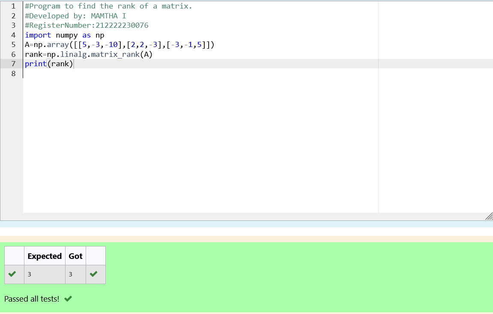

# RANK-OF-A-MATRIX

## Aim:

To write a python program to find the rank of a matrix

## Equipment’s required:

1. 	Hardware – PCs
2. 	Anaconda – Python 3.7 Installation / Moodle-Code Runner
## Algorithm:

### Step 1: 

Import numpy module.
### Step 2: 

Initialize an array with given values by np.array()
### Step 3:

 Using the np.linalg.matrix_rank(), we can find the rank of the given matrix.
### Step 4: 
Print the found rank.
## Program:
#Program to find the rank of a matrix.

#Developed by: MAMTHA I

#RegisterNumber:212222230076
```
import numpy as np
A=np.array([[5,-3,-10],[2,2,-3],[-3,-1,5]])
rank=np.linalg.matrix_rank(A)
print(rank)
```

## Output:

## Result:
Thus the rank for the given matrix is successfully solved by  using a python program.

